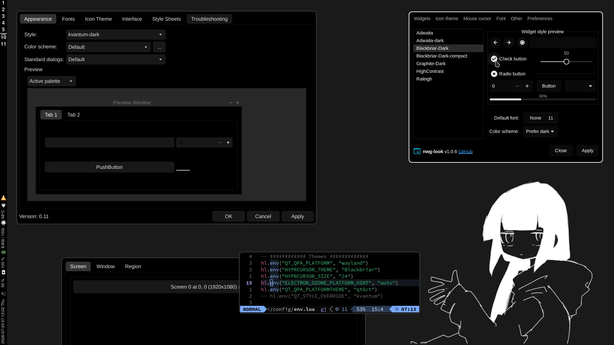

# Blackbriar Theme

Sharp, unified theme focused on black backgrounds and white outlines,
based on vinceliuice's [Graphite GTK][ggtk] and [Graphite KDE][gkde] themes.



## setup

First make sure this setup is actually relevant to you.
I'm on Hyprland, so I don't really target KDE or XFCE.

| Component                                    | Status                                       |
| -------------------------------------------- | -------------------------------------------- |
| GTK3, GTK4 applications                      | ✅                                           |
| libadwaita                                   | ✅ (by vinceliuice's symlink forcing)        |
| Qt6 widgets via Kvantum                      | ✅                                           |
| KDE/Qt color scheme                          | ✅                                           |
| XCursor theme                                | ✅ (just vendored [qogir][qogir])            |
| Hyprland                                     | Yeah (too lazy to test elsewhere)            |
| XFCE and XFWM                                | ¯\\\_(ツ)_/¯ Inherited; who knows if it works|
| Plasma Shell, Aurorae, SDDM, lock-screen QML | ❌ excluded. kde's DE will def be broken     |

Good? Great. Pull

```sh
git clone --recurse-submodules https://github.com/swomf/Blackbriar-theme
cd Blackbriar-theme
# if u cloned but forgot to submodule:
# git submodule update --init --recursive
```

then install

```sh
./scripts/install
# Or install one side:
# ./scripts/install gtk
# ./scripts/install qt
# ./scripts/install cursor
```

then equip the themes with your favorite theme switcher tools:

- `nwg-look` -> Blackbriar-Dark
- `kvantummanager` -> BlackbriarDark
- `qt6ct` -> kvantum-dark
- `hyprland` lua, for persistency

    ```lua
    hl.env("QT_QPA_PLATFORMTHEME", "qt6ct")
    -- QT_STYLE_OVERRIDE is not necessary to be set.

    -- See https://wiki.hypr.land/Hypr-Ecosystem/hyprcursor/
    hl.env("XCURSOR_THEME", "Blackbriar")
    hl.env("XCURSOR_SIZE", "24")
    hl.env("HYPRCURSOR_THEME", "Blackbriar")
    hl.env("HYPRCURSOR_SIZE", "24")
    ````
- other commands for the current session

    ```bash
    hyprctl setcursor Blackbriar 24
    gsettings set org.gnome.desktop.interface cursor-theme Blackbriar
    gsettings set org.gnome.desktop.interface cursor-size 24
    ```

If you have Firefox Color you can use this [share link][sfox] to make
Firefox's theme match.

<sup>I can't publish it because Firefox is annoyed
at the overload of jet-black/adjacent themes lol.
Compared to the other themes, mine adds better
cursor-hovering-flips-colors support.</sup>

## what is this nonsense?

I really like vinceliuice's [Graphite GTK][ggtk] and [Graphite KDE][gkde]
themes. But I found that the maintaining of forks ([1][sgtk], [2][skde])
was too annoying for what I wanted. Since I don't use KDE or XFCE anymore
I don't need full-fledged QML or whatnot. I just carefully change values.

This repo bootstraps my careful changes atop pinned vinceliuice commits.

The former [Blackbriar GTK][sgtk] and [Blackbriar KDE][skde]
repositories are just historical now. Compared to the old repos,

- I don't use the `-compact` version
- kvantum _actually_ themes QT apps
- I don't maintain half-broken QML

### but swomf, doesn't this sacrifice git's advantages??

Maybe. But my change style is odd and not really well-represented
by forking/patching. Here

- I just pin the git submodules
- I transform by tracking the amount of matches I change then
  review whenever I hop to the present

[ggtk]: https://github.com/vinceliuice/Graphite-gtk-theme
[gkde]: https://github.com/vinceliuice/Graphite-kde-theme
[qogir]: https://github.com/vinceliuice/Qogir-icon-theme/tree/master/src/cursors
[sgtk]: https://github.com/swomf/Blackbriar-gtk-theme
[skde]: https://github.com/swomf/Blackbriar-kde-theme
[sfox]: https://color.firefox.com/?theme=XQAAAAJ0AQAAAAAAAABBKYhm849SCia6aSqEGccwS-xMDPrv2Sw6Caq-qy5QgqeHG4K15QeDoRokmgjiM6AAxM3X9F70ZoGsfXBn8NHNS5chMvkRB4ubMyj96LA5TsM9yBeD-fLr7M3skzK9h0UOu0ms_i2E7dGTbWM2w_W7SvQYSdZokWwWk8xfs3Ua53OL7DJbbcKr-qOOZ56XfJHf8UkG_PuOS5yE0xzGOi4h2SS1Y3OHRfJTNrclVnyy-oswVg
